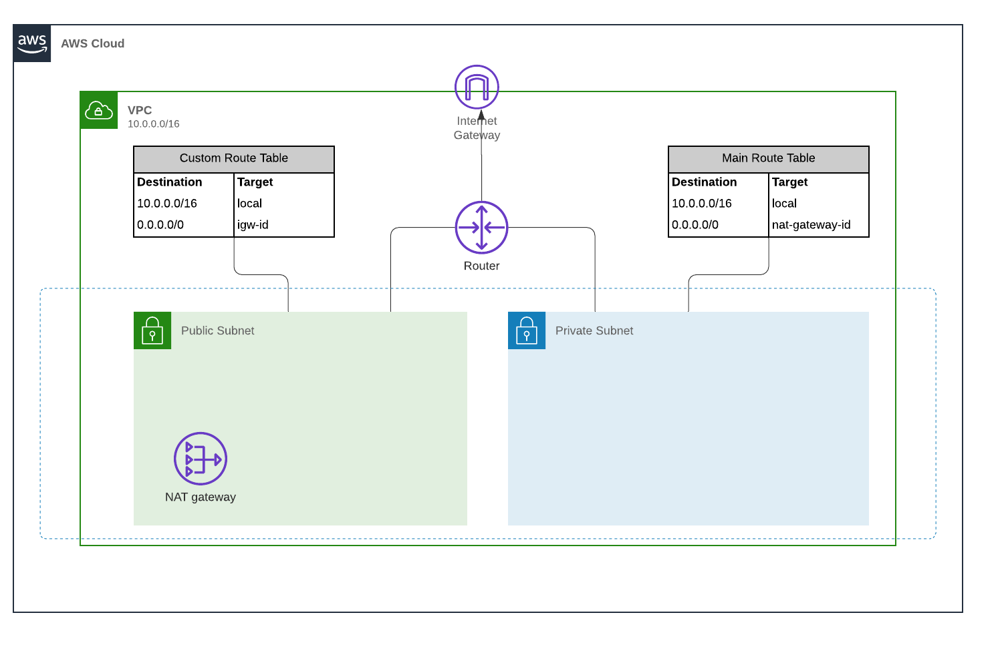
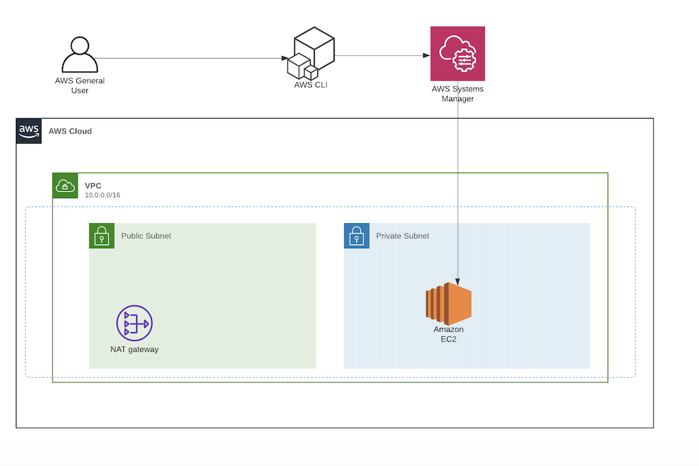

# Bastion-less: Accessing Private EC2 instance with Session Manager

In this repository we'll set up a Private EC2 instance (in a private subnet), and use SSM session manager to access the instance and access a Jupyter Notebook server using PostFowarding for AWS Sytems Manger.

Session Manager provides secure instance management **without opening inbound ports** or **setting up bastion hosts** or **managing the SSH keys**.

# Introduction

It is well known that we connot directly connect to a private EC2 instance unless there is VPN Connectivity or Direct Connect or other network connectivity source with the VPC. A common approach to connect to a EC2 intance on a private subnet of your VPC is to use a **Bastion Host**.

A **Bastion Host** is a server whose purpose is to provide access to a private network from a external network (such as: the Internet). Because of its exposure to potential attack, a bastion host must minimize the chances of penetrations. When using a bastion host, you log into the bastion host first, and then into your target private instance. With this approach only the bastion host will have an external IP address.


The bastion host also has a cost associated with it as it is a running EC2 instance. Even a t2.micro costs about $10/month.

However there are some drawbacks:

- You will need to allow SSH inbound rule at your bastion
- You need to open ports on yout private EC2 instance in order to connect it to your bastion
- You will need to manage SSH key credentials of your users: You will need to generate a ssh key pair for each user or get a copy of the same SSH key for your users
- Cost: The bastion host also has a cost associated with it as it is a running EC2 instance. Even a t2.micro costs about $10/month.

**Session Manager** can be used to access instances within private subnets that allow no ingress from the internet. AWS SSM provides the ability to establish a shell on your systems through its native service, or by using it as a tunnel for other protocols, such as Secure Shell (SSH). Advantages:

- It will log the commands issued during the session, as well as the results. You can save the logs in s3 if you wish.
- Shell access is completely contained within Identity and Access Management (IAM) policies, you won't need to manage SSH keys
- The user does not need to use bastion host and Public IPs.
- No need to open the ports in the security groups

# Folder Structure
```
.
|-- Images
|-- LICENSE
|-- README.md
|-- data.tf
|-- ec2_private.tf
|-- iam.tf
|-- main.tf
|-- network
|   |-- elastic_ip.tf
|   |-- main.tf
|   |-- route_table.tf
|   |-- subnets.tf
|   |-- terraform.tfvars
|   `-- variables.tf
|-- policies
|   `-- session-manager.json
|-- security_group.tf
|-- variables.tf
`-- variables.tfvars
```
# Prerequisites

## SSM Plugin
You will need to Install the Session Manager plugin for the Aws CLI in order to use the CLI to start and end sessions that connect your to your managed instances.

You can check on how to install the plugin for different OS in [here](https://docs.aws.amazon.com/systems-manager/latest/userguide/session-manager-working-with-install-plugin.html)

## Network Configuration



If do not have this set up ready, you can use the Terraform template on folder `network`.
Fill the `terraform.tfvars` with your desired configuration and then run: `terraform apply -var-file='terraform.tfvars'`
*terraform.tfvars*
```
availability_zones = ["us-east-1a", "us-east-1b", "us-east-1c"]
name               = "NAME OF YOUR APPLICATION"
private_start_ip   = "30"
public_start_ip    = "20"
region             = "us-east-1"
subnet_prefix      = "10.0"
vpc_cidr           = "10.0.0.0/16"
```

# Usage

## EC2 instances configurations

Our instance will be deployed on the Private Subnet without a Public IP address configuration since we won't need it.
In order to allow Session Manager access to our instance will need to attach the following IAM role: AmazonSSMManagedInstanceCore. This policy grants instances the permissions needed for core Systems Manager functionality.
For the VPC security group we will not need to include any inbound rules, allowing only outbound traffic.

If you already have the network ready, run the terraform template: `terraform apply -var-file='variables.tfvars'`. It will launch the EC2 instance in the Private Subnet.

## Session Manager - Start a session

```
$ aws ssm start-session --target {YOUR_TARGET_INSTANCE_ID}
```


## Session Manager - Port Forwarding
In this post, we won't go through how to set up a Jupyter Notebook Server on an EC2 instance, but you can find all the information need to do so on this [link](https://www.dataplyr.com/blog/2017/04/22/aws-post/).
Once the prerequisites are met, you use the AWS CLI  to create the tunnel:
```
$ aws ssm start-session --target {YOUR_TARGET_INSTANCE_ID} --document-name AWS-StartPortForwardingSession --parameters "portNumber"=["8888"],"localPortNumber"=["8888"]
```

# References
- https://aws.amazon.com/blogs/security/how-to-record-ssh-sessions-established-through-a-bastion-host/
- https://www.1cloudhub.com/connect-ec2-private-instance-using-session-manager-go-bastion-less/
- https://www.netskope.com/blog/leaving-bastion-hosts-behind-part-2-aws
- https://www.knowledgehut.com/tutorials/aws/aws-nat-gateway
- https://www.ssh.com/ssh/tunneling/example
- https://aws.amazon.com/es/blogs/aws/new-port-forwarding-using-aws-system-manager-sessions-manager/
- https://www.ibexlabs.com/improving-systems-management-with-aws-systems-manager-session-manager/
